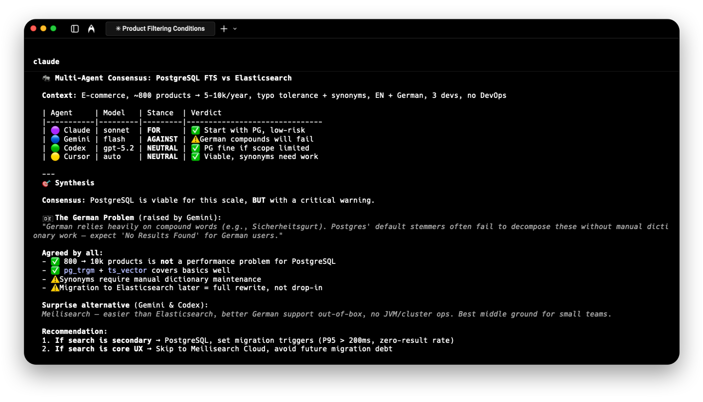

# CAG - CLI Agents Wrapper

CLI wrapper for multiple AI agent CLIs (Claude, Gemini, Codex, Cursor, Antigravity) with compare/consensus/council modes and session resume.



## Features

- **Unified interface** — single CLI for Claude, Gemini, Codex, Cursor, and Antigravity with consistent flags and output
- **Session resume** — continue conversations with `-r <session_id>`
- **Compare mode** — run multiple agents in parallel and keep each answer as a resumable branch
- **Consensus mode** — run multiple models in parallel with stance-based prompts (for/against/neutral)
- **Council mode** — multi-stage deliberation: independent answers → peer review → chairman synthesis
- **MCP server** — integrate with Cursor, Claude Code, and other MCP-compatible tools
- **Configurable** — override executables and arguments per agent

## Requirements

This tool wraps external AI CLIs that must be installed separately:

| CLI | Install | Status |
|-----|---------|--------|
| `claude` | [Claude Code](https://docs.anthropic.com/en/docs/claude-code) | |
| `gemini` | [Gemini CLI](https://github.com/google-gemini/gemini-cli) | **Deprecated** — superseded by Antigravity |
| `agy` (`antigravity`) | [Antigravity CLI](https://antigravity.google/product/antigravity-cli) | Enabled by `cag detect` when installed |
| `codex` | [Codex CLI](https://github.com/openai/codex) | |
| `cursor` | [Cursor Agent CLI](https://cursor.com/cli) | |

> [!NOTE]
> **Gemini CLI** is deprecated in favor of **Antigravity CLI** (`agy`). The `gemini` agent remains available for now.

You only need to install the CLIs you plan to use.
If you don't want to use some of the agents, you can disable them in the config.


## Installation

### macOS / Linux (Homebrew) — recommended

```bash
brew tap stanislavlysenko0912/cag https://github.com/stanislavlysenko0912/cag
brew install cag
```

### macOS / Linux (curl)

```bash
curl -fsSL https://raw.githubusercontent.com/stanislavlysenko0912/cag/main/install.sh | bash
```

### Windows (PowerShell)

```powershell
irm https://raw.githubusercontent.com/stanislavlysenko0912/cag/main/install.ps1 | iex
```

> [!NOTE]
> After installation, run [cag detect](#detect) to enable only the agents installed on your system.

## Updating

### Homebrew (macOS/Linux)

```bash
brew upgrade cag
```

### Manual install (all platforms)

Re-run the install script — it will download the latest version:

```bash
# macOS / Linux
curl -fsSL https://raw.githubusercontent.com/stanislavlysenko0912/cag/main/install.sh | bash

# Windows
irm https://raw.githubusercontent.com/stanislavlysenko0912/cag/main/install.ps1 | iex
```

## Commands

### Agents

```bash
cag claude -m sonnet "Review this function"
cag gemini -m pro "Find issues in this parser"   # deprecated — prefer antigravity
cag antigravity "Find issues in this parser"     # work in progress (enable in config)
cag codex -m gpt "Explain this architecture"
cag cursor -m composer-2.5 "Summarize this architecture"
```

Common flags:

- `-m, --model` – override model
- `-s, --system` – system prompt (agent-specific)
- `-r, --resume` – resume session
- `-j, --json` – raw JSON output
- `--meta` – show token/latency metadata

Prompt commands also accept piped stdin. When stdin is piped, CAG appends it
after the argument prompt:

```bash
git diff | cag codex -m mini "Review this change"
```

Models and aliases:

- **claude**: `claude-sonnet-4-6` (alias `sonnet`, default), `claude-opus-4-8` (alias `opus`), `claude-haiku-4-5` (alias `haiku`)
- **gemini** (deprecated): `gemini-3-flash-preview` (alias `flash`, default), `gemini-3.1-pro-preview` (alias `pro`), `gemini-3.1-flash-lite-preview` (alias `flash-lite`)
- **antigravity**: `configured` (alias `current`, default) uses AGY CLI settings; CAG can also pass AGY model labels through aliases such as `gemini-3-5-flash-medium`, `flash-low`, and `sonnet`
- **codex**: `gpt-5.5` (alias `gpt`, default), `gpt-5.3-codex` (alias `codex`), `gpt-5.5-mini` (alias `mini`)
- **cursor**: curated slugs below; run `cursor-agent models` for the full account list
  - `composer-2.5-fast` (default), `composer-2.5` — solid-tier agent models
  - `gemini-3.5-flash` — solid-tier, fast and capable for advice and discussion
  - `gemini-3.1-pro` — top-tier
  - `grok-4.3` — mid-tier second opinion
  - `gpt-5.5-high`, `claude-opus-4-8-thinking-max` — front-tier (above top)

> [!CAUTION]
> **⚠️ Permission Note:** Agents run with elevated permissions for non-interactive execution:
>
> | Agent | Flags | Effect |
> |-------|-------|--------|
> | **claude** | `--permission-mode acceptEdits` | Auto-approve file edits |
> | **codex** | `--dangerously-bypass-approvals-and-sandbox` | Bypass all approvals and sandbox |
> | **gemini** | `--yolo` | Auto-approve all actions |
> | **cursor** | `--force` | Force allow commands unless explicitly denied |
>
> These flags enable automated usage. Override via config if you need different behavior.

### consensus

Run multiple models in parallel with stance-based prompts:

```bash
cag consensus \
  -a "gemini:pro:for" \
  -a "codex:gpt:against" \
  -p "I think we should use Redis with 5min TTL" \ # optional proposal
  "Should we add caching for user profiles, 10k RPM, data changes hourly?"

cag consensus --title "Profile caching debate" \
  -a "gemini:pro:for" \
  -a "codex:gpt:against" \
  "Should we add caching for user profiles, 10k RPM, data changes hourly?"

cag consensus --list
cag consensus --inspect cons-12345678
```

### compare

Run multiple agents in parallel. Each successful answer includes its own `session_id`, so you can continue later with the existing agent command.

```bash
cag compare \
  -a "claude:sonnet" \
  -a "codex:gpt" \
  "How should we cache profiles for 10k RPM?"

cag compare --title "Profile caching options" \
  -a "claude:sonnet" \
  -a "gemini:pro" \
  "Longer prompt..."

cag compare --list
cag compare --inspect cmp_12345678
```

### council

Multi-stage council: independent answers, peer reviews with ranking, then chairman synthesis.
By default, participant answers are hidden in CLI output. Use `--include-answers` to show answers and session IDs.

Council idea is based on Andrej Karpathy’s [`llm-council`](https://github.com/karpathy/llm-council/tree/master).

```bash
cag council \
  -a "gemini:pro" \
  -a "codex:gpt" \
  -c "claude:sonnet" \
  "Design a caching strategy for 10k RPM API"

cag council --title "Caching council" \
  -a "gemini:pro" \
  -a "codex:gpt" \
  -c "claude:sonnet" \
  "Design a caching strategy for 10k RPM API"

cag council --list
cag council --inspect council_12345678
```

### prime

Prints a Markdown usage guide for agent commands and consensus.
Takes up approximately about ~1k context tokens.

```bash
cag prime
```

Useful when you don't want to use MCP, agent still will get all necessary information about tool.
You can add it to `hooks` for example, and agent will get all necessary information about tool.

Example for Claude Code:
```json
{
  "hooks": {
    "SessionStart": [
      {
        "matcher": "",
        "hooks": [
          {
            "type": "command",
            "command": "cag prime"
          }
        ]
      }
    ]
  }
}
```

### Model Context Protocol (MCP)

Run MCP server for integrating with tools that support MCP (Cursor, Claude Code, etc.):

```bash
# stdio (default)
cag mcp

# HTTP (local server)
cag mcp --transport http --host 127.0.0.1 --port 7331
```

```json
"mcpServers": {
  "cag": {
    "command": "cag",
    "args": [
      "mcp"
    ]
  }
}
```

Available MCP tools:

- `cag_agent` – run a single agent
- `cag_compare` – run parallel independent answers with per-branch `session_id`
- `cag_consensus` – run consensus across multiple agents
- `cag_council` – run multi-stage council (answers, reviews, chairman)
- `cag_models` – list supported models

> [!NOTE]
> All tools use about ~3k context tokens. If you very care about context tokens, you can use `cag prime` with hooks, or directly tell agent to run prime command before start working (if your agent don't support hooks) to get the usage guide, instead of mcp tools.

### Sessions

Each agent call prints `session_id`. Use `-r` to continue:

```bash
cag codex "How should I cache profiles?"
# session_id: abc-123
cag codex -r abc-123 "What if data changes hourly?"
```

Compare runs print `compare_id` and keep the per-agent `session_id` values for branch follow-up.
Consensus sessions print `consensus_id` and can be resumed with `-r`.
Council runs print `council_id` and are persisted for inspection and follow-up. The deliberation itself is not resumable.

Example compare follow-up:

```bash
cag compare -a "claude:sonnet" -a "codex:gpt" "How should we cache profiles?"
# compare_id: cmp_12345678
# session_id: claude-session
# session_id: codex-session

cag codex -r codex-session "Continue this direction"
```

### detect

Detect installed agent CLIs and update config enablement:

```bash
cag detect
```

This updates `enabled` flags in your config based on what executables are found on PATH.

## Config

Config is optional and auto-created on first run.

Paths:
- macOS: `~/.cag/config.json`
- Linux: `~/.local/share/cag/config.json` (or `$XDG_DATA_HOME/cag/config.json`)
- Windows: `%APPDATA%\\cag\\config.json` (fallback: `%LOCALAPPDATA%`, `%USERPROFILE%`)
- Other/unknown: `<cwd>/.cag/config.json`

For more available options, see [config.schema.json](docs/config.schema.json).

#### Example: override codex binary

If you want to use a different binary than the default one, or `cag` cannot find the tool, you can set `agents.<name>.executable` to a full path in your config.

```json
{
  "agents": {
    "codex": {
      "enabled": true, // if false, agent will be hidden from help/prime/models output and cannot be invoked
      "executable": "codex",
      "default_model": "gpt-5.5",
      "additional_args": ["--search", "exec", "--json", "--skip-git-repo-check"]
    }
  }
}
```

#### Windows only: override codex binary

Windows example (npm-installed CLI shim):

```json
{
  "agents": {
    "codex": {
      "executable": "C:\\\\Users\\\\you\\\\AppData\\\\Roaming\\\\npm\\\\codex.cmd"
    }
  }
}
```

#### Example: shell mode (non-portable)

Use if you rely on shell functions/aliases:

```json
{
  "agents": {
    "codex": {
      "shell_executable": "/bin/zsh",
      "shell_args": ["-i", "-c"],
      "shell_command_prefix": "codex_project --search exec --json --skip-git-repo-check"
    }
  }
}
```

In this example, the command will be run via the shell executable `/bin/zsh` with the arguments `-i -c`.
`codex_project` is a shell function/alias, that allow use codex with project specific settings.

#### Example: run via WSL (Windows only, optional)

Use this when your CLI tools are installed in WSL and not in Windows.

```json
{
  "agents": {
    "claude": {
      "shell_executable": "wsl.exe",
      "shell_args": ["-e", "bash", "-lc"],
      "shell_command_prefix": "claude -p --output-format json --permission-mode acceptEdits"
    }
  }
}
```

This runs `claude` inside WSL via `bash -lc`. Adjust `shell_command_prefix` per agent.

Invalid configs are reported to stderr with per-field errors.

## Development

FVM is used to pin the Dart SDK version for contributors. If you don’t use FVM, you can ignore `.fvmrc` (if present) and run plain `dart` commands.

### Commands (recommended with FVM)

```bash
fvm dart pub get
fvm dart run bin/cag.dart <command>
fvm dart analyze
```

### Formatting

```bash
make fmt
```

To enable the pre-commit formatter hook:

```bash
make hooks
```

### Build & Install

```bash
make gen          # generate schema
make build        # builds ./build/cag
make install      # installs to ~/bin on macOS, /usr/local/bin on Linux
```

### Project Structure

- `bin/` CLI entrypoint + commands
- `lib/` public API
- `lib/src/` agents, parsers, runners, consensus, config
- `docs/` documentation and schema
- `test/` unit tests
