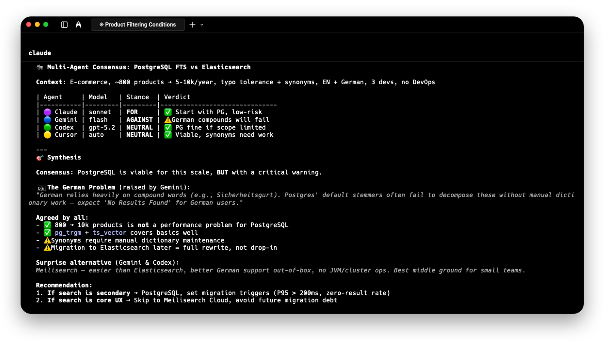

# CAG - CLI Agents Wrapper

CLI wrapper for multiple AI agent CLIs (Claude, Gemini, Codex, Cursor, Antigravity, OpenCode, Pi) with compare/consensus/council modes and session resume.



## Features

- **Unified interface** — single CLI for Claude, Gemini, Codex, Cursor, Antigravity, OpenCode, and Pi with consistent flags and output
- **Session resume** — continue conversations with `-r <session_id>`
- **Compare mode** — run multiple agents in parallel and keep each answer as a resumable branch
- **Consensus mode** — run multiple models in parallel with stance-based prompts (for/against/neutral)
- **Council mode** — multi-stage deliberation: independent answers → peer review → chairman synthesis
- **MCP server** — integrate with Cursor, Claude Code, and other MCP-compatible tools
- **Configurable** — override executables and arguments per agent

## Requirements

This tool wraps external AI CLIs that must be installed separately:

| CLI | Install |
|-----|---------|
| `claude` | [Claude Code](https://docs.anthropic.com/en/docs/claude-code) |
| `gemini` | [Gemini CLI](https://github.com/google-gemini/gemini-cli) |
| `agy` | [Antigravity CLI](https://antigravity.google/product/antigravity-cli) |
| `codex` | [Codex CLI](https://github.com/openai/codex) |
| `cursor` | [Cursor Agent CLI](https://cursor.com/cli) |
| `opencode` | [OpenCode](https://opencode.ai/docs/) |
| `pi` | [Pi](https://pi.dev/docs/latest/usage) |

> [!NOTE]
> **Gemini CLI** is deprecated in favor of **Antigravity CLI** (`agy`). The `gemini` agent remains available for now. And will be removed in the future.

You only need to install the CLIs you plan to use.
If you don't want to use some of the agents, you can disable them in the config.


## Installation

### macOS / Linux (Homebrew) — recommended

```bash
brew tap stanislavlysenko0912/cag https://github.com/stanislavlysenko0912/cag
brew install cag
```

### macOS / Linux (curl)

```bash
curl -fsSL https://raw.githubusercontent.com/stanislavlysenko0912/cag/main/install.sh | bash
```

### Windows (PowerShell)

```powershell
irm https://raw.githubusercontent.com/stanislavlysenko0912/cag/main/install.ps1 | iex
```

> [!NOTE]
> After installation, run [cag detect](#detect) to enable only the agents installed on your system.

## Updating

### Homebrew (macOS/Linux)

```bash
brew upgrade cag
```

### Manual install (all platforms)

Re-run the install script — it will download the latest version:

```bash
# macOS / Linux
curl -fsSL https://raw.githubusercontent.com/stanislavlysenko0912/cag/main/install.sh | bash

# Windows
irm https://raw.githubusercontent.com/stanislavlysenko0912/cag/main/install.ps1 | iex
```

## Commands

### Agents

```bash
cag claude -m sonnet "Review this function"
cag gemini -m pro "Find issues in this parser"   # deprecated — prefer antigravity
cag antigravity "Find issues in this parser"     # work in progress (enable in config)
cag codex -m gpt "Explain this architecture"
cag cursor -m composer-2.5 "Summarize this architecture"
cag opencode "Review this change"
cag opencode -m provider/model -r session_id "Continue"
cag pi -m openai/gpt-5.6 "Review this change" # disabled by default
```

Common flags:

- `-m, --model` – override model
- `-s, --system` – system prompt (agent-specific)
- `-r, --resume` – resume session
- `-j, --json` – raw JSON output
- `--meta` – show token/latency metadata

Prompt commands also accept piped stdin. When stdin is piped, CAG appends it
after the argument prompt:

```bash
git diff | cag codex -m mini "Review this change"
```

Models and aliases:

- **claude**: `claude-opus-5` (alias `opus`, default), `claude-fable-5`, `claude-sonnet-5` (alias `sonnet`), `claude-haiku-4-5` (alias `haiku`)
- **gemini** (deprecated): `gemini-3-flash-preview` (alias `flash`, default), `gemini-3.1-pro-preview` (alias `pro`), `gemini-3.1-flash-lite-preview` (alias `flash-lite`)
- **antigravity**: `gemini-3-6-flash-medium` (alias `flash`, default), `gemini-3-6-flash-high` (alias `flash-high`), `gemini-3-6-flash-low` (alias `flash-low`), `gemini-3-1-pro-high` (alias `pro-high`), `gemini-3-1-pro-low` (alias `pro-low`), `claude-sonnet-4-6-thinking` (alias `sonnet`), `claude-opus-4-6-thinking` (alias `opus`), `gpt-oss-120b-medium` (alias `oss`)
- **codex**: `gpt-5.6-sol` (aliases `sol`, `gpt`, default), `gpt-5.6-terra` (alias `terra`), `gpt-5.6-luna` (alias `luna`), `gpt-5.3-codex` (alias `codex`), `gpt-5.5-mini` (alias `mini`)
- **cursor**: curated slugs below; run `cursor-agent models` for the full account list
  - `composer-2.5-fast` (default), `composer-2.5` — solid-tier agent models
  - `gemini-3.6-flash` — solid-tier, fast and capable for advice and discussion
  - `gemini-3.1-pro` — top-tier
  - `cursor-grok-4.5-high` (aliases `grok-4.5`, `grok`), `cursor-grok-4.5-high-fast` (aliases `grok-4.5-fast`, `grok-fast`) — contrasting second opinion
  - `gpt-5.5-high`, `claude-opus-5-thinking-max` — front-tier (above top)
- **opencode**: CAG leaves the model unset by default; use OpenCode's
  `provider/model` identifier with `-m` when an explicit model is needed
- **pi**: disabled by default and has no imported model catalog; enable it in
  config or the TUI, then add only the models you want or pass a one-off
  `provider/model` identifier with `-m`; `cag detect` deliberately leaves it
  disabled

### Model scores

Every built-in model carries four routing scores from 1 to 10, higher is better.
They are shown in `cag prime`, the `cag_models` MCP tool, and the TUI:

| Score | Meaning |
|-------|---------|
| `cost` | Effective cost — higher means cheaper |
| `intelligence` | How hard a problem the model handles unsupervised |
| `speed` | How fast the answer comes back |
| `taste` | UI/UX, code quality, API design, and copy |

Use `cost` only as a tie-breaker. When the axes conflict for work that ships,
prefer `intelligence`, then `taste`, then `cost`; user-facing UI, copy, and API
design want `taste` 7 or higher.

Scores are configurable: override them for built-in models in `config.json`, or
set them on custom models directly in the TUI model form.

> [!CAUTION]
> **⚠️ Permission Note:** Agents run with elevated permissions for non-interactive execution:
>
> | Agent | Flags | Effect |
> |-------|-------|--------|
> | **claude** | `--permission-mode acceptEdits` | Auto-approve file edits |
> | **codex** | `--dangerously-bypass-approvals-and-sandbox` | Bypass all approvals and sandbox |
> | **gemini** | `--yolo` | Auto-approve all actions |
> | **cursor** | `--force` | Force allow commands unless explicitly denied |
>
> These flags enable automated usage. Override via config if you need different behavior.

Pi runs headlessly with its configured tools; `--mode json` changes only the
output format. CAG does not add `--approve`, so project trust follows Pi's own
settings.

### consensus

Run multiple models in parallel with stance-based prompts:

```bash
cag consensus \
  -a "gemini:pro:for" \
  -a "codex:gpt:against" \
  -p "I think we should use Redis with 5min TTL" \ # optional proposal
  "Should we add caching for user profiles, 10k RPM, data changes hourly?"

cag consensus --title "Profile caching debate" \
  -a "gemini:pro:for" \
  -a "codex:gpt:against" \
  "Should we add caching for user profiles, 10k RPM, data changes hourly?"

cag consensus --list
cag consensus --inspect cons-12345678
```

### compare

Run multiple agents in parallel. Each successful answer includes its own `session_id`, so you can continue later with the existing agent command.

```bash
cag compare \
  -a "claude:sonnet" \
  -a "codex:gpt" \
  "How should we cache profiles for 10k RPM?"

cag compare --title "Profile caching options" \
  -a "claude:sonnet" \
  -a "gemini:pro" \
  "Longer prompt..."

cag compare --list
cag compare --inspect cmp_12345678
```

### council

Multi-stage council: independent answers, peer reviews with ranking, then chairman synthesis.
By default, participant answers are hidden in CLI output. Use `--include-answers` to show answers and session IDs.

Council idea is based on Andrej Karpathy’s [`llm-council`](https://github.com/karpathy/llm-council/tree/master).

```bash
cag council \
  -a "gemini:pro" \
  -a "codex:gpt" \
  -c "claude:sonnet" \
  "Design a caching strategy for 10k RPM API"

cag council --title "Caching council" \
  -a "gemini:pro" \
  -a "codex:gpt" \
  -c "claude:sonnet" \
  "Design a caching strategy for 10k RPM API"

cag council --list
cag council --inspect council_12345678
```

### prime

Prints a Markdown usage guide for agent commands and consensus.
Takes up approximately about ~1k context tokens.

```bash
cag prime
```

Useful when you don't want to use MCP, agent still will get all necessary information about tool.
You can add it to `hooks` for example, and agent will get all necessary information about tool.

Example for Claude Code:
```json
{
  "hooks": {
    "SessionStart": [
      {
        "matcher": "",
        "hooks": [
          {
            "type": "command",
            "command": "cag prime"
          }
        ]
      }
    ]
  }
}
```

### Model Context Protocol (MCP)

Run MCP server for integrating with tools that support MCP (Cursor, Claude Code, etc.):

```bash
# stdio (default)
cag mcp

# HTTP (local server)
cag mcp --transport http --host 127.0.0.1 --port 7331
```

```json
"mcpServers": {
  "cag": {
    "command": "cag",
    "args": [
      "mcp"
    ]
  }
}
```

Available MCP tools:

- `cag_agent` – run a single agent
- `cag_compare` – run parallel independent answers with per-branch `session_id`
- `cag_consensus` – run consensus across multiple agents
- `cag_council` – run multi-stage council (answers, reviews, chairman)
- `cag_models` – list supported models
- `cag_task` – manage background tasks started with `cag_agent` `mode: background`

#### Background runs

`cag_agent` accepts `mode: sync` (default, waits for the answer) or
`mode: background`, which returns a `task_id` immediately so the host can keep
working while the agent runs.

Manage those tasks with `cag_task`: `list`, `get`, `result`, `wait`, `wait_any`,
and `cancel`. Prefer `action: wait` over tight polling loops, and pass
`include_log: true` only when you actually need the run log — logs are opt-in to
keep payloads small. Cancellation is non-graceful: the underlying process is
killed. Finished tasks are kept in memory for one hour and then dropped.

A `task_id` is a wrapper handle, not a `session_id` — resume the conversation
with the `session_id` from the task result.

> [!NOTE]
> All tools use about ~3k context tokens. If you very care about context tokens, you can use `cag prime` with hooks, or directly tell agent to run prime command before start working (if your agent don't support hooks) to get the usage guide, instead of mcp tools.

### Sessions

Each agent call prints `session_id`. Use `-r` to continue:

```bash
cag codex "How should I cache profiles?"
# session_id: abc-123
cag codex -r abc-123 "What if data changes hourly?"
```

Compare runs print `compare_id` and keep the per-agent `session_id` values for branch follow-up.
Consensus sessions print `consensus_id` and can be resumed with `-r`.
Council runs print `council_id` and are persisted for inspection and follow-up. The deliberation itself is not resumable.

Example compare follow-up:

```bash
cag compare -a "claude:sonnet" -a "codex:gpt" "How should we cache profiles?"
# compare_id: cmp_12345678
# session_id: claude-session
# session_id: codex-session

cag codex -r codex-session "Continue this direction"
```

### detect

Detect installed agent CLIs and update config enablement:

```bash
cag detect
```

This updates `enabled` flags in your config based on what executables are found on PATH.

### doctor

Check your CAG setup without changing config:

```bash
cag doctor
```

This reports config status, enabled agents, resolved executables, versions, and
setup hints. Unlike `cag detect`, it is read-only and does not update `enabled`
flags.

Use JSON output when scripting:

```bash
cag doctor --json
```

Pass `--mcp-url` to also probe a running MCP HTTP server with a cheap `GET`:

```bash
cag doctor --mcp-url http://127.0.0.1:7331
```

### Setup (TUI)

The terminal UI is where you manage CAG settings interactively — prefer it over
hand-editing `config.json`:

```bash
cag --tui
```

From it you can:

- enable or disable agents and individual models
- pick each agent's default model
- add, edit, and delete custom models, including their routing scores
- run status diagnostics and preview CLI detection before applying it

## Config

Config is optional and auto-created on first run. For interactive editing, prefer `cag --tui` over hand-editing `config.json`.

Pi is disabled by default and deliberately does not import its full model
catalog. Enable it and define a small model list in the TUI, or configure
it directly:

```json
{
  "agents": {
    "pi": {
      "enabled": true,
      "default_model": "gpt",
      "models": [
        {
          "name": "gpt",
          "model": "openai/gpt-5.6"
        }
      ]
    }
  }
}
```

Paths:
- macOS: `~/.cag/config.json`
- Linux: `~/.local/share/cag/config.json` (or `$XDG_DATA_HOME/cag/config.json`)
- Windows: `%APPDATA%\\cag\\config.json` (fallback: `%LOCALAPPDATA%`, `%USERPROFILE%`)
- Other/unknown: `<cwd>/.cag/config.json`

For more available options, see [config.schema.json](docs/config.schema.json).

#### Example: override codex binary

If you want to use a different binary than the default one, or `cag` cannot find the tool, you can set `agents.<name>.executable` to a full path in your config.

```json
{
  "agents": {
    "codex": {
      "enabled": true, // if false, agent will be hidden from help/prime/models output and cannot be invoked
      "executable": "codex",
      "default_model": "gpt-5.5",
      "additional_args": ["--search", "exec", "--json", "--skip-git-repo-check"]
    }
  }
}
```

#### Windows only: override codex binary

Windows example (npm-installed CLI shim):

```json
{
  "agents": {
    "codex": {
      "executable": "C:\\\\Users\\\\you\\\\AppData\\\\Roaming\\\\npm\\\\codex.cmd"
    }
  }
}
```

#### Example: shell mode (non-portable)

Use if you rely on shell functions/aliases:

```json
{
  "agents": {
    "codex": {
      "shell_executable": "/bin/zsh",
      "shell_args": ["-i", "-c"],
      "shell_command_prefix": "codex_project --search exec --json --skip-git-repo-check"
    }
  }
}
```

In this example, the command will be run via the shell executable `/bin/zsh` with the arguments `-i -c`.
`codex_project` is a shell function/alias, that allow use codex with project specific settings.

#### Example: run via WSL (Windows only, optional)

Use this when your CLI tools are installed in WSL and not in Windows.

```json
{
  "agents": {
    "claude": {
      "shell_executable": "wsl.exe",
      "shell_args": ["-e", "bash", "-lc"],
      "shell_command_prefix": "claude -p --output-format json --permission-mode acceptEdits"
    }
  }
}
```

This runs `claude` inside WSL via `bash -lc`. Adjust `shell_command_prefix` per agent.

Invalid configs are reported to stderr with per-field errors.

#### Custom agents through an existing CLI adapter

Custom agents reuse a built-in CLI adapter while defining their provider,
models, environment, and CLI arguments in config. Secrets can be stored in a
`.env` file beside `config.json`; shell environment variables take precedence.

`.env` locations:
- macOS: `~/.cag/.env`
- Linux: `~/.local/share/cag/.env` (or `$XDG_DATA_HOME/cag/.env`)
- Windows: `%APPDATA%\cag\.env` (same fallbacks as `config.json`)
- Other: beside the resolved `config.json`

```dotenv
KIMI_API_KEY=...
```

```json
{
  "agents": {
    "kimi": {
      "adapter": "claude",
      "display_name": "Kimi via Claude Code",
      "default_model": "k3-256k",
      "env": {
        "ANTHROPIC_BASE_URL": "https://api.kimi.com/coding/",
        "CLAUDE_CODE_DISABLE_BUNDLED_SKILLS": "1"
      },
      "env_from": {
        "ANTHROPIC_API_KEY": "KIMI_API_KEY"
      },
      "args": [
        "--permission-mode",
        "dontAsk",
        "--tools",
        "Read,Grep,Glob,Bash",
        "--disable-slash-commands"
      ],
      "settings": {
        "permissions": {
          "allow": ["Read", "Grep", "Glob", "Bash(git status)"],
          "deny": ["Edit", "Write", "WebFetch", "WebSearch", "Agent(*)", "mcp__*"]
        }
      },
      "models": [
        {
          "name": "k3-256k",
          "env": {
            "ANTHROPIC_MODEL": "k3-256k",
            "CLAUDE_CODE_SUBAGENT_MODEL": "k3-256k",
            "CLAUDE_CODE_EFFORT_LEVEL": "high"
          }
        }
      ]
    }
  }
}
```

The configured agent is available anywhere a built-in agent is accepted:

```bash
cag kimi -m k3-256k "Review this change"
cag compare -a "kimi:k3-256k" -a "codex:gpt-5.6-terra" "Compare approaches"
```

Adapter-required transport arguments remain managed by CAG. For example, the
Claude adapter always adds `-p --output-format json`; configured `args` are
appended after them. Values referenced by `env_from` are passed only to the
selected child process and are never copied into `config.json`.

#### ACP agents

Use the `acp` adapter for local agents that implement stable ACP v1 over
JSON-RPC/stdio:

```json
{
  "agents": {
    "custom-acp-agent": {
      "adapter": "acp",
      "executable": "some-agent",
      "args": ["acp"]
    }
  }
}
```

```bash
cag custom-acp-agent "Review this change"
cag custom-acp-agent -m provider/model -r session_id "Continue"
```

CAG leaves model selection to the agent unless `--model` is provided. ACP
permission requests automatically select `allow_once`; CAG never escalates an
unavailable one-time option to `allow_always`. The initial integration does not
advertise client filesystem or terminal capabilities because local agents own
their tools.

This adapter targets ACP v1 local stdio agents. ACP v2, remote HTTP/WebSocket
transports, interactive authentication, and client-delegated filesystem or
terminal execution are outside its current scope.

## Development

FVM is used to pin the Dart SDK version for contributors. If you don’t use FVM, you can ignore `.fvmrc` (if present) and run plain `dart` commands.

### Commands (recommended with FVM)

```bash
fvm dart pub get
fvm dart run bin/cag.dart <command>
fvm dart analyze
```

### Formatting

```bash
make fmt
```

To enable the pre-commit formatter hook:

```bash
make hooks
```

### Build & Install

```bash
make gen          # generate schema
make build        # builds ./build/cag
make install      # installs to ~/bin on macOS, /usr/local/bin on Linux
```

### Project Structure

- `bin/` CLI entrypoint + commands
- `lib/` public API
- `lib/src/` agents, parsers, runners, consensus, config
- `docs/` documentation and schema
- `test/` unit tests
